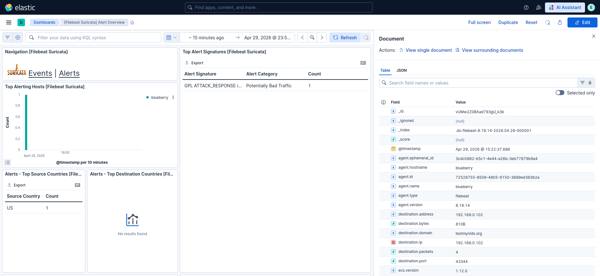
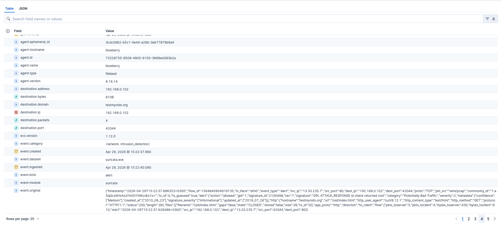

# Curling suspicious website

Basic test for Suricata is Curling http://testmynids.org/uid/index.html which generates alert because it returns suspicious looking response data. From the images in this section it can be seen that the alert is generated and it is forwarded to Kibana thorugh Elasticsearch. 

