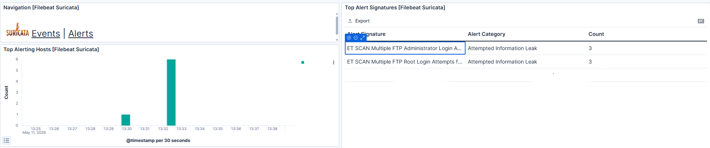
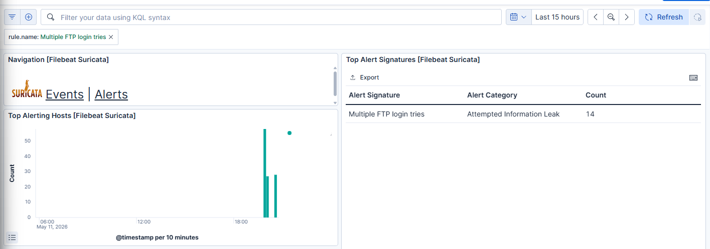

# Brute Force


According to the [MITRE ATT&CK Brute Force (T1110)](https://attack.mitre.org/techniques/T1110/), adversaries may attempt to gain unauthorized access by systematically guessing passwords or using automated tools to try large numbers of credential combinations. Common targets include services such as SSH, FTP, RDP, and web-based login portals. Brute force attacks may involve password guessing, password spraying, credential stuffing, or password cracking techniques. These attacks are often automated and can lead to unauthorized access if weak or reused passwords are used. 

## Suricata reaction to attack



For this demonstration, an FTP service was configured on the Raspberry Pi. With the current rule set, Suricata generated alerts when the usernames `root` and `admin` were used during the attack.

In a more comprehensive SIEM environment, additional alerts would likely be generated, as this simulated brute force attack used 17 common usernames combined with 10,000 commonly used passwords.

To improve detection, a custom Suricata rule was added to identify all repeated login attempts against the FTP service. The rule is shown below:


```
alert tcp $EXTERNAL_NET any -> $HOME_NET 21 (msg: "Multiple FTP login tries"; threshold: type threshold, track by_src, count 10, seconds 20; classtype:attempted-recon; sid:100046; rev:1;)
```


This rule triggers an alert when multiple connection attempts are detected from the same source within a short time period, helping identify potential brute force attacks targeting the FTP service.

In more advanced environments, additional automation could be implemented to track which usernames are being targeted and automatically respond to suspicious activity.



## How the Attack Works

For this attack, the tool **THC Hydra** was used to perform a brute force attack against an FTP service. The attack was executed using the following command:


```
hydra -L <usernames-list> -P <password-list> ftp://<ip-address> 
```


This command attempts multiple username and password combinations against the target FTP service in order to gain unauthorized access.


## Mitigation

According to the [MITRE ATT&CK Brute Force (T1110)](https://attack.mitre.org/techniques/T1110/), brute force attacks can be mitigated using strong account and authentication controls:

- **M1036 – Account Use Policies:** Implement account lockout policies after multiple failed login attempts and use conditional access rules to restrict risky logins.  
- **M1032 – Multi-factor Authentication:** Enable multi-factor authentication, especially for externally exposed services.  
- **M1027 – Password Policies:** Use strong password policies following industry best practices (e.g., NIST guidelines).  
- **M1018 – User Account Management:** Monitor and reset compromised or exposed accounts, especially those involved in suspicious login attempts.