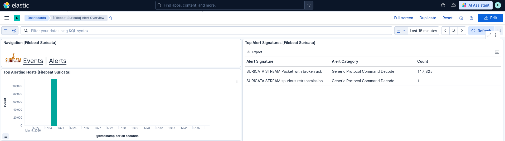

# Denial of Service

According to the [MITRE ATT&CK Denial of Service (T0814)](https://attack.mitre.org/techniques/T0814/), adversaries may perform DoS attacks to disrupt the normal functionality of devices by making them unresponsive. This can be achieved by overwhelming a device with a large number of requests or sending malformed requests that the system cannot properly handle. As a result, the targeted device may be unable to process traffic or respond to events until it recovers or is rebooted.

In some cases, attackers may exploit software vulnerabilities to trigger a denial-of-service condition or even cause permanent damage (PDoS). Certain systems, such as industrial control systems (ICS), can be especially sensitive and may become unresponsive even under relatively low levels of network activity.

## Suricata reaction to attack



Even though Suricata classifies the alerts generated during the DoS attack under the category Generic Protocol Command Decode, the sheer volume of alerts would, in most cases, strongly indicate that a DoS attack is taking place. 

The attack caused services on the Raspberry Pi to become unavailable, further indicating a denial-of-service condition.

## How the Attack Works

For this attack, **hping3** was used. This tool allows generating a high volume of TCP SYN packets toward a target.

In this demonstration, the following command was used:

```
hping3 -S --flood <target_ip> -p <port_number_of_the_service>
```

This command floods the target system with TCP SYN packets, potentially exhausting its resources and causing a denial-of-service condition.

In a local network, flooding can affect the entire network, as home routers may struggle to handle high traffic volumes (in my case, my computer was unable to access web pages during the attack).


## Mitigation

Mitigating DoS attacks can involve using Content Delivery Networks (CDNs) or specialized protection services to filter malicious traffic before it reaches the target system. Additional defenses include filtering boundary traffic by blocking attacking IP addresses, restricting targeted ports, and limiting specific protocols. To protect against SYN flood attacks, enabling SYN cookies is an effective countermeasure. [Endpoint Denial of Service](https://attack.mitre.org/techniques/T1499/)


