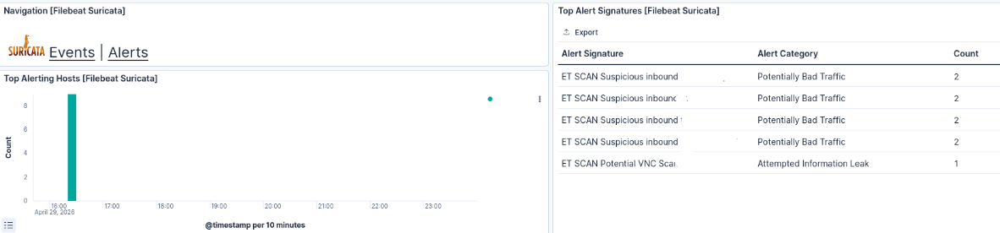

# Network Service Discovery

According to the [MITRE ATT&CK](https://attack.mitre.org/techniques/T1046/) Network Service Discovery is a technique in which adversaries attempt to identify services running on remote hosts and network infrastructure devices, including those that may be vulnerable to exploitation.

The goal is often to find services that may have vulnerabilities and could be exploited.

Attackers typically gather this information using methods like:

- Port scanning – checking which network ports are open and what services are listening on them
- Vulnerability scanning – identifying known weaknesses in those services
- Wordlist scanning – probing for commonly used service paths, names, or configurations using predefined lists

## How the attack is done


Port scanning can be performed using a tool called *nmap*. This tool is commonly used to gather information about services running on a target host.

After installing nmap tool the simple version of the attack can be done with command:

```
nmap <target_ip>
```

## Suricata reaction to attack



Suricata detected the malicious activity and generated corresponding alerts, which are displayed in the Kibana dashboard. This can be seen in the figure above


## Mitigation

According to the [MITRE Corporation](https://attack.mitre.org/) MITRE ATT&CK framework, the following mitigations can help reduce the risk of Network Service Discovery:

- **M1042 – Disable or Remove Feature or Program:** Ensure that unnecessary ports and services are closed to prevent discovery and potential exploitation.  
- **M1031 – Network Intrusion Prevention:** Use network intrusion detection and prevention systems to detect and block remote service scanning activity.  
- **M1030 – Network Segmentation:** Implement proper network segmentation to protect critical servers and devices from unauthorized discovery and access.

### Chosen Strategy

For this demonstration, I chose to apply a port knocking technique to conceal the ports in use. While firewall hardening and automated IP address blocking would likely be more effective in a real-world scenario, they are not suitable for the scope of this demo.