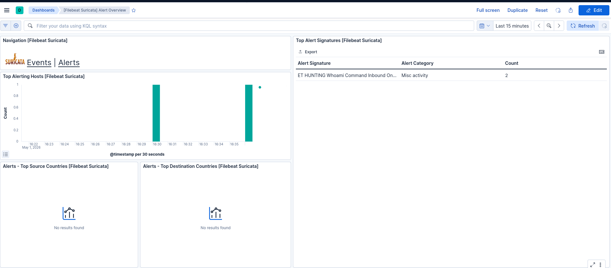

# Reverse Shell

According to the [MITRE ATT&CK Command and Scripting Interpreter (T1059)](https://attack.mitre.org/techniques/T1059/), reverse shells are a common technique where an adversary establishes an outbound connection from a compromised system back to an attacker-controlled host. This enables remote command execution while bypassing inbound firewall restrictions, as the connection is initiated from within the target environment.

## Suricata reaction to attack

Suricata generated alert when command whoami was used after establishing the connection to the target. 

In current alert settings basic commands such as ls or cd were not recognised. 

The main idea behind a reverse shell is that the target initiates the connection, allowing the attacker to bypass inbound firewall restrictions and gain remote command execution on the compromised system.

## How the attack is done

This demonstration shows how a basic reverse shell works in practice using a client-server model implemented in Python.

The attack consists of two components:

- **Listener (attacker machine):** Waits for an incoming connection  
- **Client (target machine):** Initiates the connection back to the attacker  

### How the attack works

This demonstration shows a simple reverse shell implemented using a client-server model in Python.

The core idea is to get the target (client) to execute a program that connects back to the attacker’s server.

- The attacker runs a listener that waits for incoming connections.
- The target system connects back to the attacker, creating an outbound connection that can bypass firewall rules blocking inbound traffic.
- Once connected, the attacker can send commands to the target.
- The target executes the commands locally and returns the output, allowing remote control of the system.

The connection remains active until it is manually terminated.

## Mitigation

## Mitigations

According to the [MITRE ATT&CK framework](https://attack.mitre.org/techniques/T1059/), the following mitigations can help reduce the risk of command execution and reverse shell activity:

- **M1049 – Antivirus/Antimalware:** Use antivirus solutions to automatically detect and quarantine suspicious files.  

- **M1040 – Behavior Prevention on Endpoint:** Enable security features such as Attack Surface Reduction (ASR) rules to block potentially malicious script execution.  

- **M1045 – Code Signing:** Allow only signed scripts to be executed where possible to ensure integrity and trust.  

- **M1042 – Disable or Remove Feature or Program:** Remove or disable unnecessary shells and scripting interpreters to reduce attack surface.  

- **M1038 – Execution Prevention:** Apply application control policies (e.g., PowerShell Constrained Language Mode) to restrict dangerous functionality.  

- **M1033 – Limit Software Installation:** Prevent users from installing unauthorized scripting tools or interpreters.  

- **M1026 – Privileged Account Management:** Restrict powerful scripting environments (like PowerShell) to administrators and use features such as Just Enough Administration (JEA) to limit capabilities.  

- **M1021 – Restrict Web-Based Content:** Use script-blocking extensions and ad blockers to prevent execution of malicious web-based scripts.

### Used mitigation method

In this demonstration, the chosen mitigation was to use an automated antivirus solution with **ClamAV** running with sudo privileges to detect and handle potentially malicious files.

ClamAV did not detect the reverse shell used in this demonstration. This is likely because ClamAV relies on signature-based detection, and the script is a simple custom implementation that does not match known malware signatures. Obfuscation was not used, but even with obfuscation, detection would not be guaranteed. 

Using the ELK Stack with Suricata makes it possible to detect potentially malicious network connections and respond to them in real time. This can include actions such as terminating running processes or blocking the source of the connection to prevent further activity.